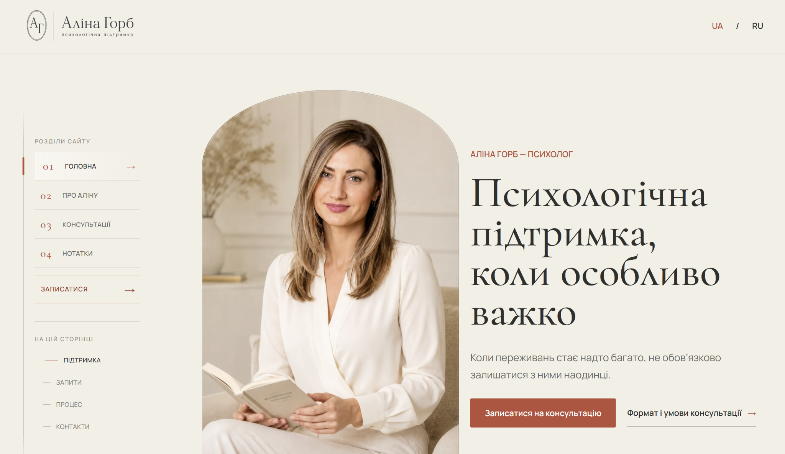
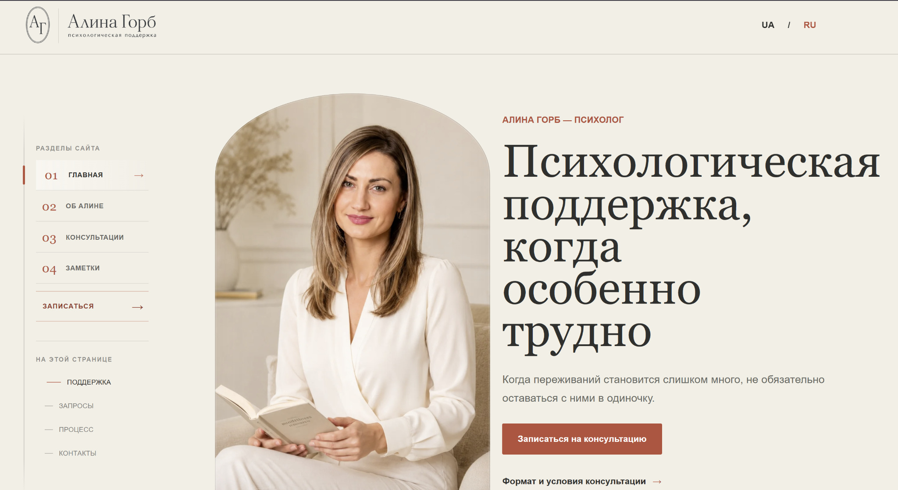
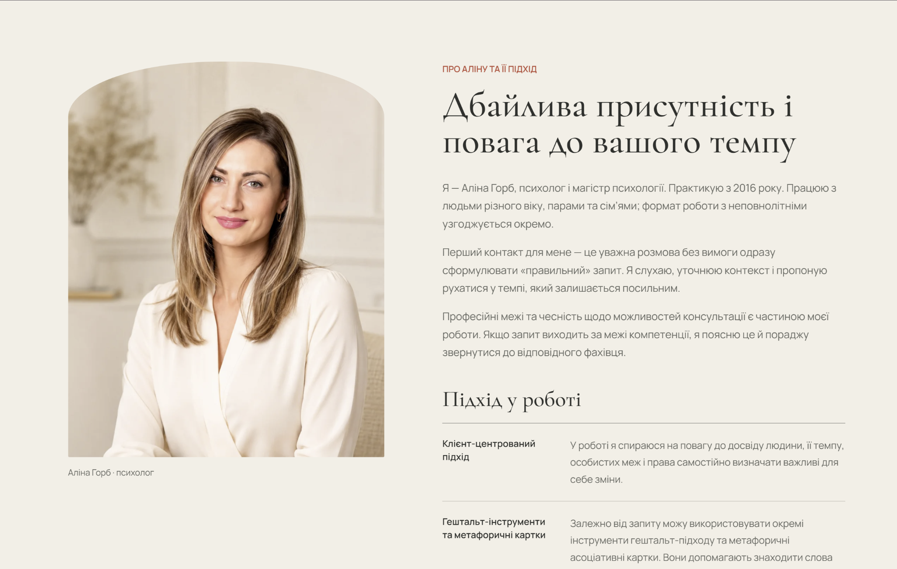
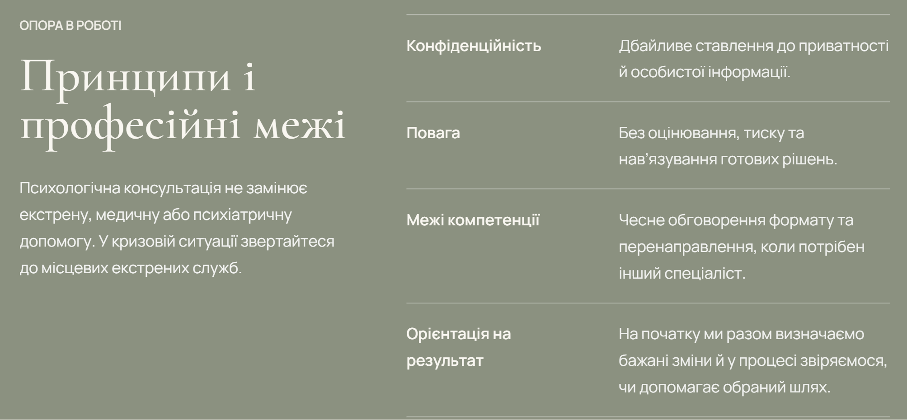
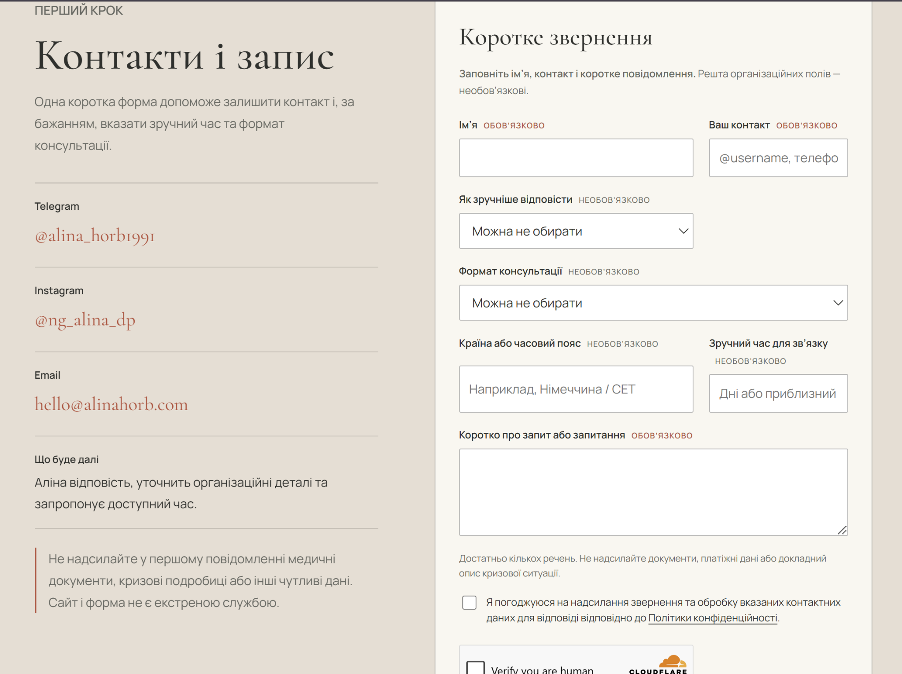
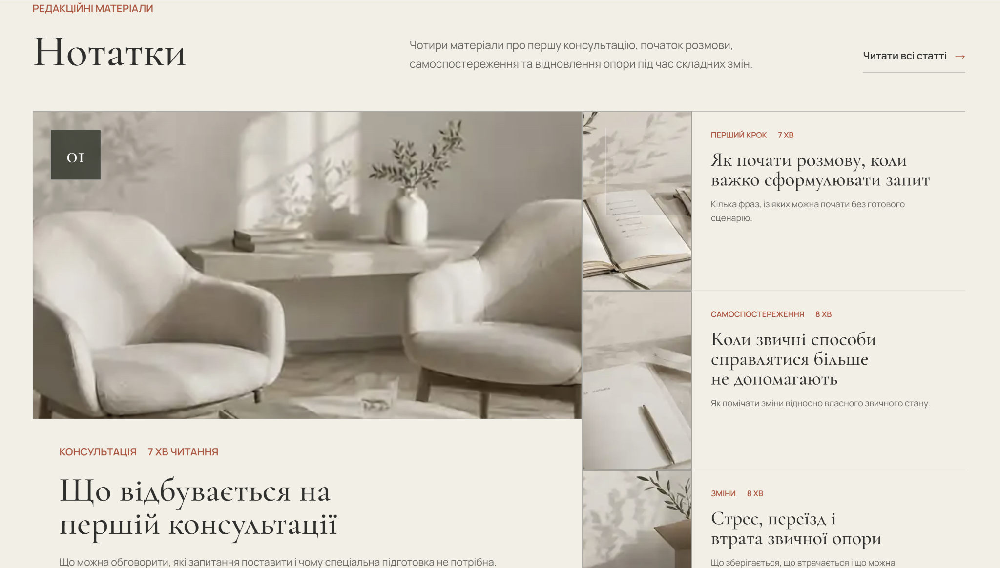
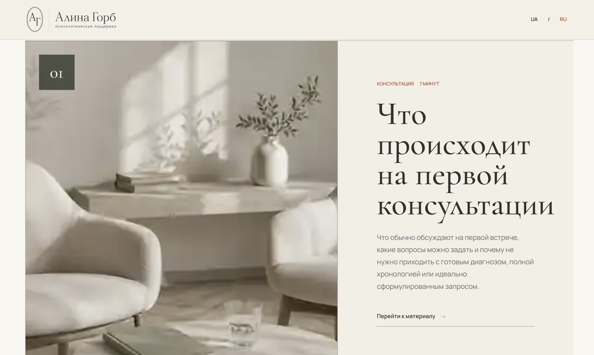
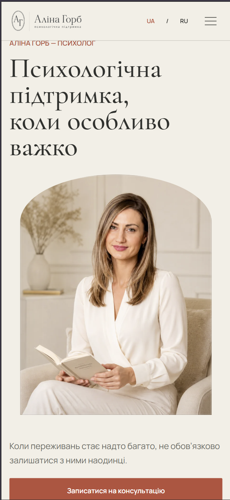

# Alina Horb Final Asset Review Index V1

Eight approved screenshot frames are packaged below in their final order. Each preview uses the lossless WebP delivery file and links to both standalone formats.

## 01. UA Homepage Desktop

Route: `/` 
Role: primary identity and UA homepage context 
Dimensions: `2048 x 1185`

[PNG master](../masters/alina-horb-home-ua-desktop-master.png) | [Lossless WebP](../delivery/alina-horb-home-ua-desktop.webp)

## 02. RU Homepage Desktop

Route: `/ru/` 
Role: RU counterpart for bilingual hierarchy comparison 
Dimensions: `2048 x 1120`

[PNG master](../masters/alina-horb-home-ru-desktop-master.png) | [Lossless WebP](../delivery/alina-horb-home-ru-desktop.webp)

## 03. UA About and Approach

Route: `/about/` 
Role: personal presence and professional approach 
Dimensions: `2048 x 1299`

[PNG master](../masters/alina-horb-about-approach-ua-desktop-master.png) | [Lossless WebP](../delivery/alina-horb-about-approach-ua-desktop.webp)

## 04. UA Principles and Professional Boundaries

Route: `/consultations/` 
Role: principles, privacy, respect, and limits of competence 
Dimensions: `2007 x 930`

[PNG master](../masters/alina-horb-principles-boundaries-ua-desktop-master.png) | [Lossless WebP](../delivery/alina-horb-principles-boundaries-ua-desktop.webp)

## 05. UA Compact Intake

Route: `/consultations/#contact` 
Role: compact, clear, privacy-conscious first-contact flow 
Dimensions: `2048 x 1532`

[PNG master](../masters/alina-horb-intake-ua-desktop-master.png) | [Lossless WebP](../delivery/alina-horb-intake-ua-desktop.webp)

## 06. UA Notes Overview

Route: `/notes/` 
Role: structured expert publishing system 
Dimensions: `2048 x 1165`

[PNG master](../masters/alina-horb-notes-overview-ua-desktop-master.png) | [Lossless WebP](../delivery/alina-horb-notes-overview-ua-desktop.webp)

## 07. RU First Consultation Article

Route: `/ru/notes/first-consultation/` 
Role: representative long-form editorial hierarchy 
Dimensions: `2048 x 1225`

[PNG master](../masters/alina-horb-article-first-consultation-ru-desktop-master.png) | [Lossless WebP](../delivery/alina-horb-article-first-consultation-ru-desktop.webp)

## 08. UA Homepage Mobile

Route: `/` 
Role: mobile preservation of identity, hierarchy, portrait, and primary action 
Dimensions: `648 x 1404`

[PNG master](../masters/alina-horb-home-ua-mobile-master.png) | [Lossless WebP](../delivery/alina-horb-home-ua-mobile.webp)

