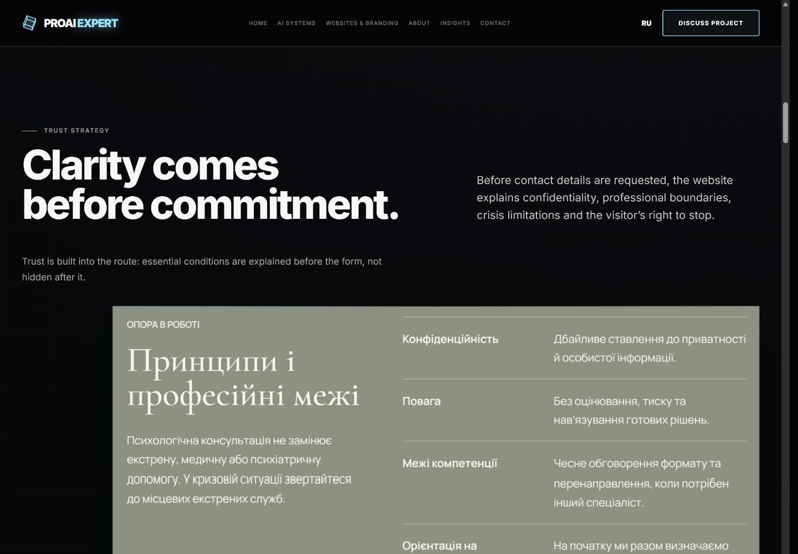
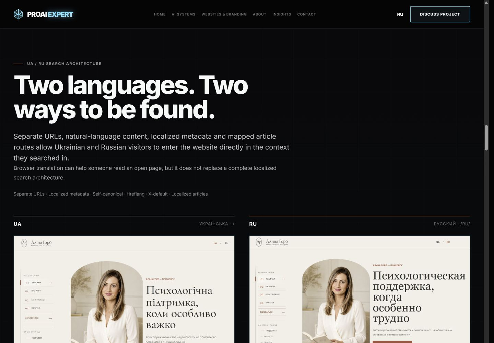

# Alina Horb Flagship Case V3 - Owner Review

Implementation commit: `621f984df9bb7d5f0964cb2b3d296a417cb833a0`

This package contains eight standalone browser captures for owner review of the non-public V3 feature branch. No pull request, merge, publication, or deployment has been performed.

Local previews:

- EN: <http://127.0.0.1:4175/case-studies/alina-horb/>
- RU: <http://127.0.0.1:4175/ru/case-studies/alina-horb/>

## 01 - EN Hero, Desktop

Purpose: validate the dark ProAI-led Hero, headline hierarchy, CTA balance, and approved client evidence.

[Open standalone image](01-en-hero-desktop-1440x1000.jpg)

## 02 - RU Hero, Desktop

Purpose: validate the equivalent Russian Hero and controlled language-specific line wrapping.

[Open standalone image](02-ru-hero-desktop-1440x1000.jpg)

## 03 - EN Hero, Mobile

Purpose: validate mobile reading order, CTA access, and evidence scale at 390 px.

[Open standalone image](03-en-hero-mobile-390x844.jpg)

## 04 - RU Hero, Mobile

Purpose: validate Russian mobile hierarchy and layout stability at 390 px.

[Open standalone image](04-ru-hero-mobile-390x844.jpg)

## 05 - Trust Strategy

Purpose: validate the dark evidence field, live trust copy, and readable professional-boundaries screenshot.

[Open standalone image](05-trust-strategy-desktop-1440x1000.jpg)

## 06 - Bilingual Architecture

Purpose: validate intentional UA/RU alignment and equal visual status for both language routes.

[Open standalone image](06-bilingual-architecture-desktop-1440x1000.jpg)

## 07 - Notes System

Purpose: validate the dominant publishing overview and supporting long-form article evidence.

[Open standalone image](07-notes-system-desktop-1440x1000.jpg)

## 08 - Final CTA and Case Transition

Purpose: validate the final conversion hierarchy and transition to the Financial Stream case.

[Open standalone image](08-final-cta-footer-desktop-1440x1000.jpg)

