# Local Repair Pro Screenshot Intake V1

Temporary GitHub review set created from 13 screenshots supplied by the owner on 2026-07-20.

- Project: **Local Repair Pro — Premium Handyman Website Concept**
- Status: **Website concept — in development**
- Purpose: preserve current visual material for owner review and future portfolio planning
- Production impact: none
- Main branch impact: none

## Review documents

- [Initial visual assessment](INITIAL_VISUAL_ASSESSMENT_V1.md)
- [Asset manifest](ASSET_MANIFEST.md)
- [Existing portfolio case pack](../CASE_PACK.md)

## Contact sheet

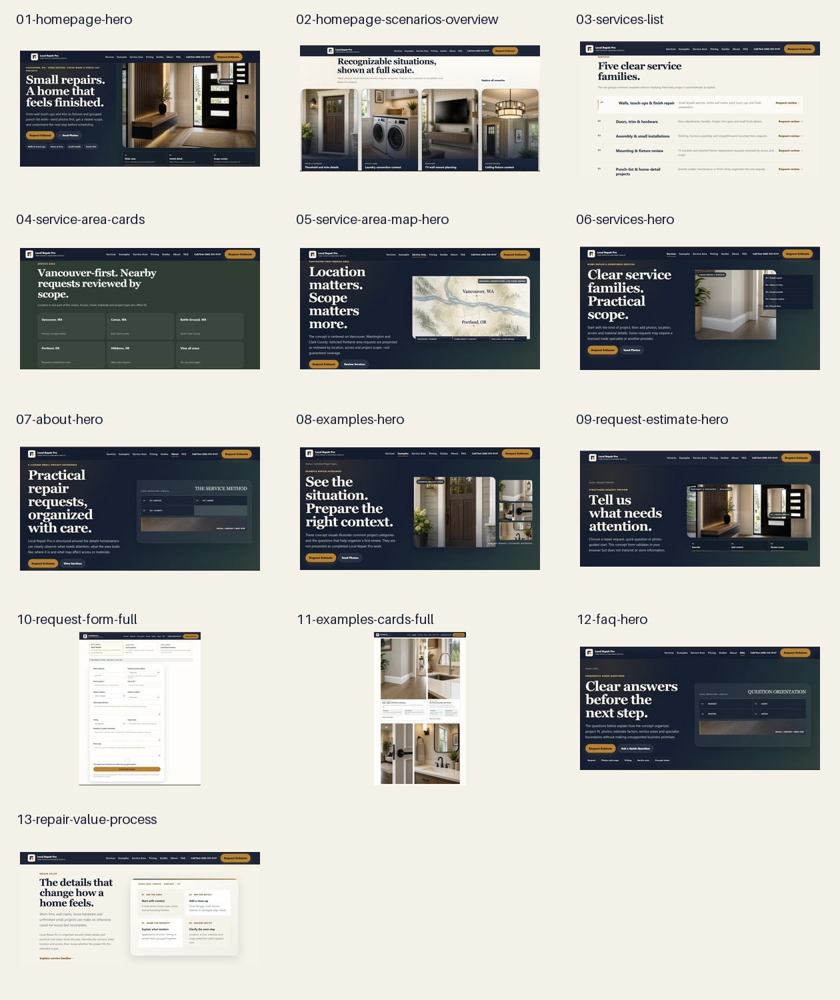

## Individual screenshots

### 01 — Homepage hero

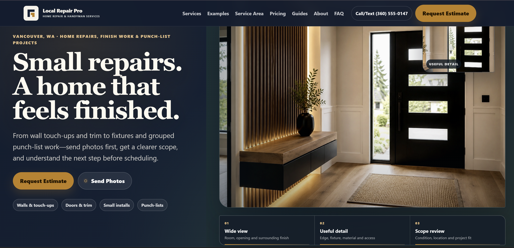

### 02 — Homepage scenarios overview

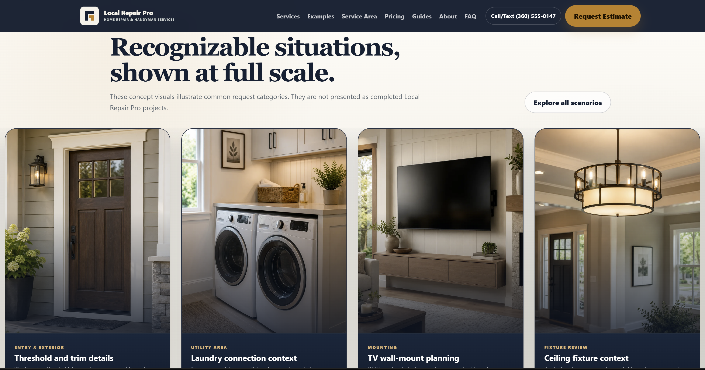

### 03 — Services list

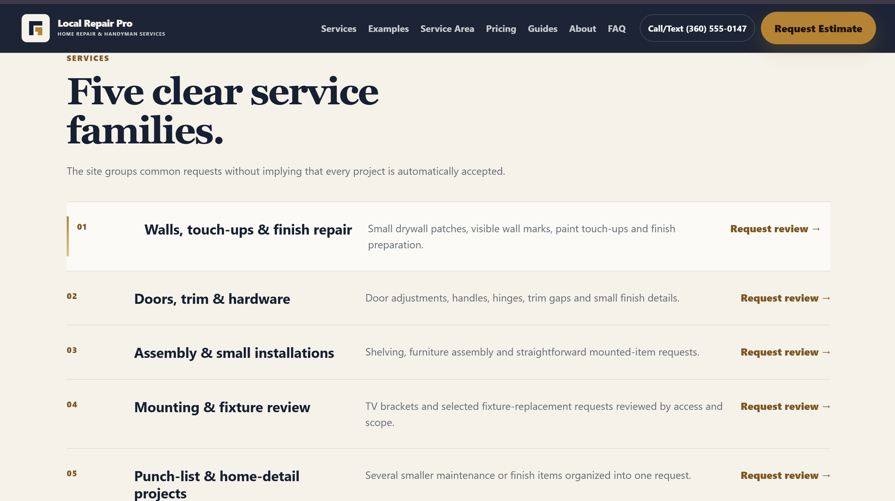

### 04 — Service-area cards

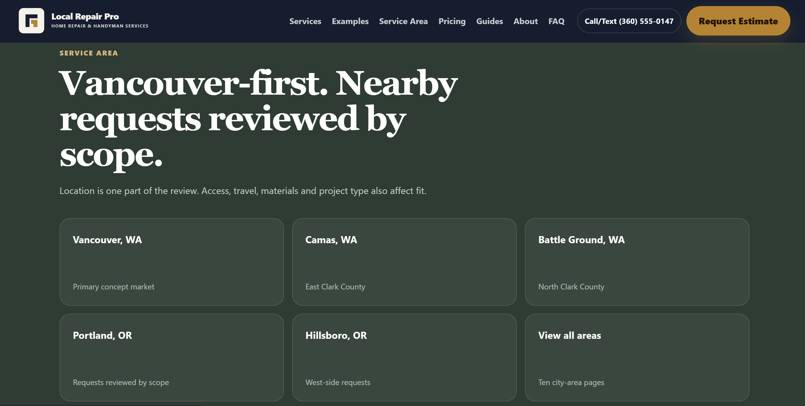

### 05 — Service-area map hero

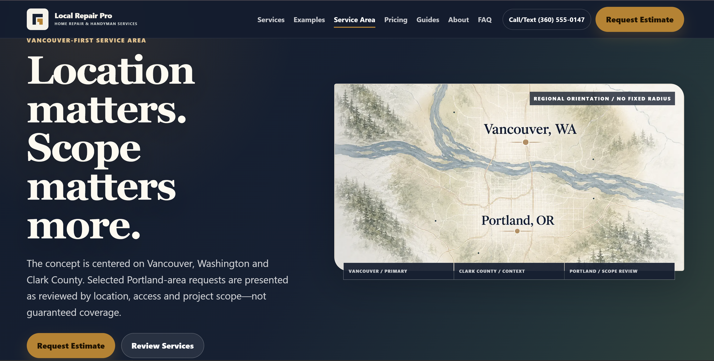

### 06 — Services hero

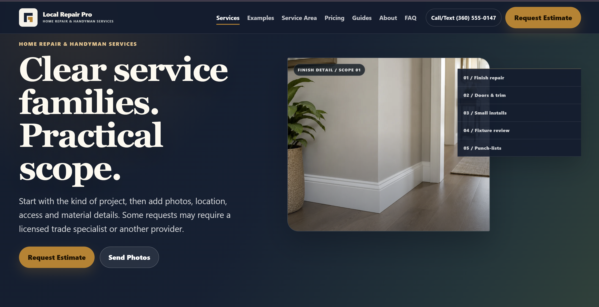

### 07 — About hero

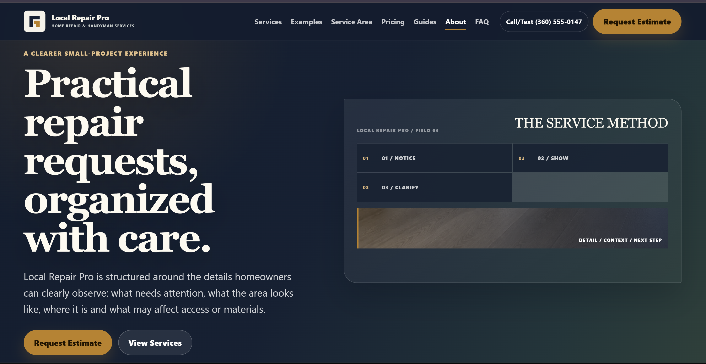

### 08 — Examples hero

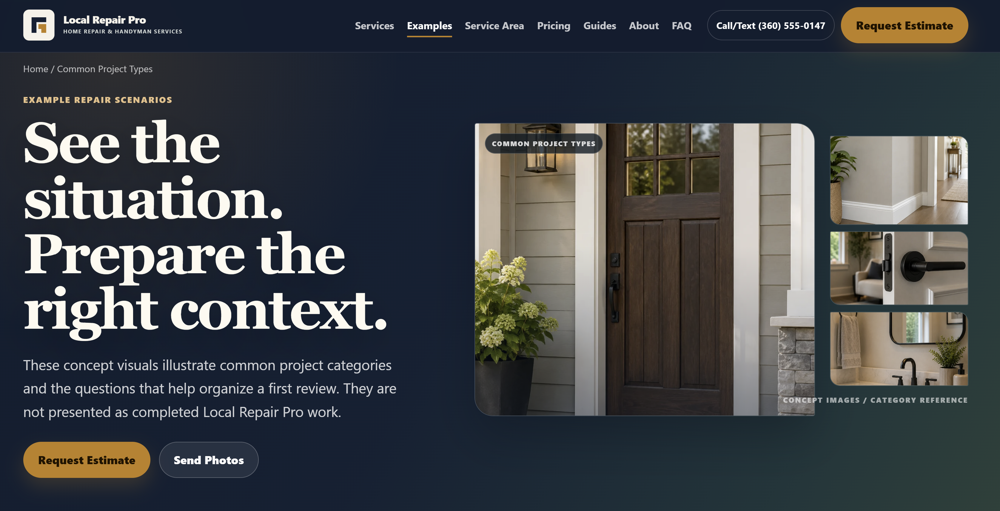

### 09 — Request-estimate hero

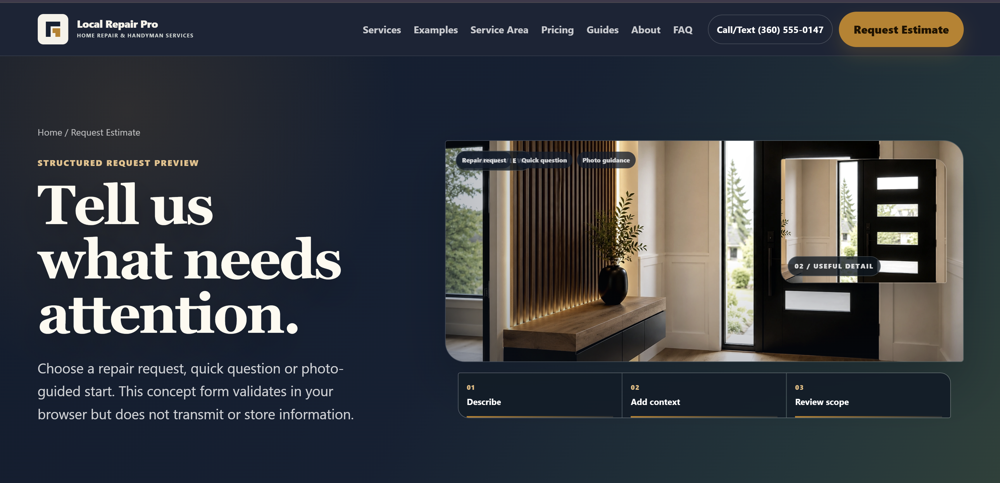

### 10 — Request form

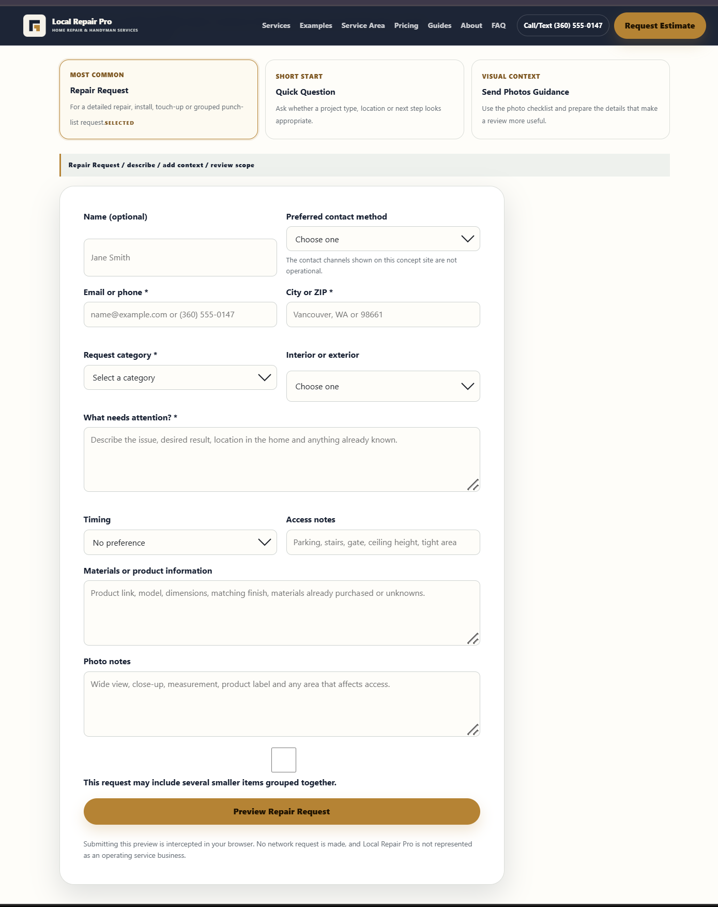

### 11 — Examples cards

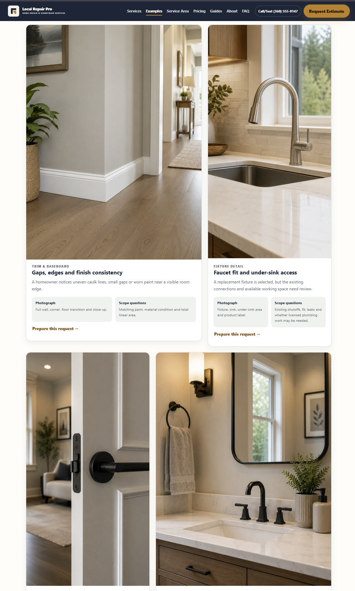

### 12 — FAQ hero

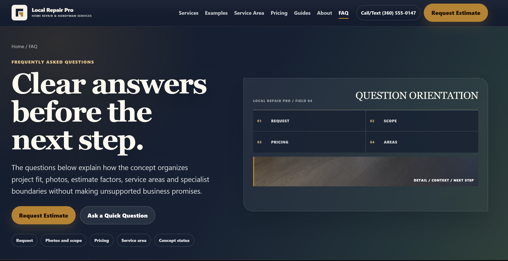

### 13 — Repair-value process

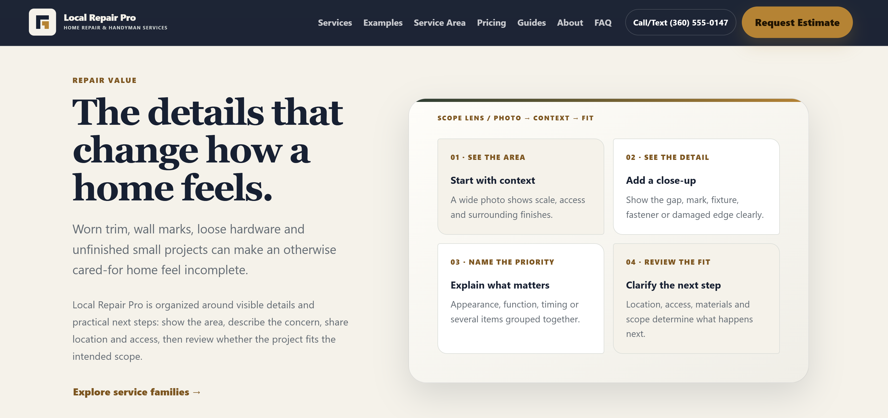

## Source mapping

| Review file | Original uploaded filename |
|---|---|
| `01-homepage-hero.webp` | `Screenshot 2026-07-20 152018.png` |
| `02-homepage-scenarios-overview.webp` | `Screenshot 2026-07-20 152137.png` |
| `03-services-list.webp` | `Screenshot 2026-07-20 152239.png` |
| `04-service-area-cards.webp` | `Screenshot 2026-07-20 152324.png` |
| `05-service-area-map-hero.webp` | `Screenshot 2026-07-20 152409.png` |
| `06-services-hero.webp` | `Screenshot 2026-07-20 152434.png` |
| `07-about-hero.webp` | `Screenshot 2026-07-20 152515.png` |
| `08-examples-hero.webp` | `Screenshot 2026-07-20 152536.png` |
| `09-request-estimate-hero.webp` | `Screenshot 2026-07-20 152549.png` |
| `10-request-form-full.webp` | `Screenshot 2026-07-20 152616.png` |
| `11-examples-cards-full.webp` | `Screenshot 2026-07-20 152725.png` |
| `12-faq-hero.webp` | `Screenshot 2026-07-20 152755.png` |
| `13-repair-value-process.webp` | `Screenshot 2026-07-20 152830.png` |

The review copies were converted to high-quality WebP for compact GitHub storage. The original screen dimensions were preserved.
