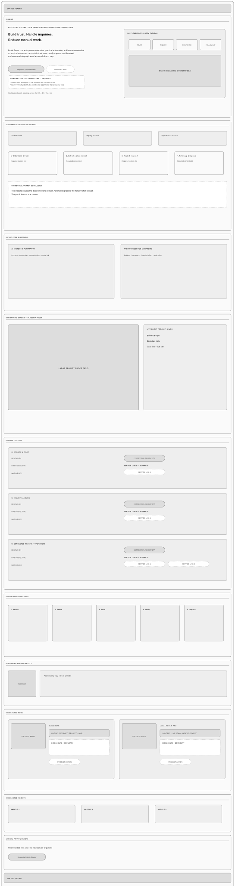
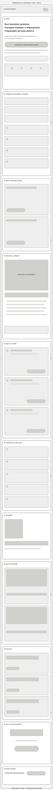
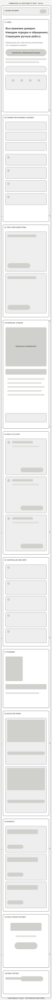
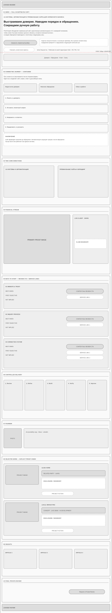

# PROAI EXPERT HOMEPAGE V2 — LOW-FIDELITY FULL-PAGE MAP

**Status:** Corrected candidate for focused low-fidelity review  
**Version:** V1.1  
**Date:** 2026-08-05  
**Branch:** `agent/homepage-v2-low-fidelity-map`  
**Source Content Architecture blob:** `cdfe0188cdf5d886066f6effdceaf9e8bddd704b`  
**Original low-fidelity review verdict:** `TARGETED CORRECTION`  
**Production code authorization:** none  
**Visual-concept authorization:** none

---

# 1. PURPOSE AND CORRECTION SCOPE

The maps test the accepted ten-block Homepage V2 content system as one complete commercial journey before visual styling or implementation.

This V1.1 correction resolves only the blocking findings in:

`docs/site-evolution/homepage-v2-low-fidelity/03_LOW_FIDELITY_REVIEW_REPORT.md`

Corrected areas:

1. full accepted RU Hero content is represented at `390`, `320`, and `844 × 390`;
2. mandatory Hero expectation copy and accountability line are represented at `1440`;
3. short-landscape Hero and Connected Journey geometry are contained within their owning sections;
4. Connected Journey conclusion is present on every responsive map;
5. Ways to Start reserves separate space for review CTA and required service links;
6. Selected Work reserves distinct status, disclosure/boundary, and action zones.

The correction does not alter:

- the accepted ten-block order;
- Content Architecture copy;
- service hierarchy;
- proof taxonomy;
- Header or Footer;
- Homepage, Contact, YAML, HTML, CSS, or JavaScript;
- any production route or asset.

---

# 2. CORRECTED MAP SET

## Desktop — 1440 px



Declared document size:

```text
1440 × 5405
```

Correction proof:

- exact EN Hero hierarchy remains visible;
- the primary CTA has a dedicated adjacent expectation-copy field;
- the accountability line has an explicit slot;
- each Ways-to-Start situation shows a contextual review CTA plus its service-link collection;
- the combined situation shows two service links;
- each Selected Work item has separate status, disclosure/boundary, and action fields.

## Mobile — 390 px



Declared document size:

```text
390 × 6168
```

Correction proof:

- exact accepted RU eyebrow is shown;
- exact accepted RU H1 is shown;
- exact accepted full supporting copy is shown;
- primary CTA, exact expectation copy, secondary CTA, accountability line, and system strip follow in the accepted order;
- Connected Journey includes all four steps and its exact conclusion;
- each Ways-to-Start item includes review CTA and service links;
- Selected Work reserves normal-flow multi-line status and disclosure/boundary space.

## Narrow mobile — 320 px



Declared document size:

```text
320 × 6428
```

Correction proof:

- no shortened RU Hero substitute is used;
- the primary action remains visible in the natural opening sequence;
- no horizontal chip, fixed-width poster, or hover-dependent proof field is required;
- Alina Horb and Local Repair Pro status/disclosure areas are intentionally multi-line;
- the combined Ways-to-Start situation visibly owns two service links.

## Short landscape — 844 × 390 viewport



Declared document size:

```text
844 × 4564
```

Correction proof:

- the first `390 px` viewport marker is retained;
- exact accepted RU eyebrow, H1, full supporting copy, and primary CTA are represented before that fold;
- expectation copy, secondary CTA, accountability line, and system strip remain in the Hero without overflow;
- the system strip is contained inside the Hero;
- all four Connected Journey steps and the conclusion are contained inside the Connected Journey section;
- Two Core Directions begins only after the Connected Journey ends;
- no sticky behavior, horizontal scrolling, or viewport-filling section is implied.

---

# 3. TEN-BLOCK ARCHITECTURE LOCK

The DOM and reading order remain fixed in every map:

1. `hero`;
2. `connected-journey`;
3. `directions`;
4. `client-work`;
5. `ways-to-start`;
6. `process`;
7. `founder`;
8. `selected-work`;
9. `insights`;
10. `private-review`.

Header precedes the page body. Footer follows Block 10. Both remain locked integration boundaries.

---

# 4. HERO FIDELITY CONTRACT

## Desktop EN

The map must reserve visible space for:

1. eyebrow;
2. H1;
3. full supporting copy;
4. primary CTA;
5. exact expectation copy adjacent to the primary CTA;
6. secondary CTA;
7. accountability line;
8. supplementary system tableau.

The system tableau does not own unique essential content.

## Responsive RU

The `390`, `320`, and `844 × 390` maps use the accepted RU content without shortening:

**Eyebrow**

```text
AI-СИСТЕМЫ, АВТОМАТИЗАЦИЯ И ПРЕМИАЛЬНЫЕ САЙТЫ ДЛЯ СЕРВИСНОГО БИЗНЕСА
```

**H1**

```text
Выстраиваем доверие. Наводим порядок в обращениях. Сокращаем ручную работу.
```

**Supporting copy**

```text
ProAI Expert объединяет премиальный сайт, практическую автоматизацию и AI с проверкой человеком, чтобы клиент быстрее понимал ценность бизнеса, оставлял полезный контекст, а каждое обращение переходило к понятному следующему шагу.
```

**Primary CTA**

```text
Запросить первичный разбор
```

**Expectation copy**

```text
Коротко опишите бизнес и основную проблему. Мы оценим соответствие, определим приоритет и предложим следующий полезный шаг.
```

**Secondary CTA**

```text
Смотреть клиентские проекты
```

**Accountability line**

```text
Штат Вашингтон · Работаем по всей территории США · EN / RU / UA
```

No RU copy shortening is authorized by this map correction. A Reviewer may evaluate the exact mapped hierarchy but must not rewrite the content during this gate.

---

# 5. CONNECTED JOURNEY CONTRACT

Every map represents:

1. three friction signals;
2. exactly four connected steps;
3. one visible conclusion after the four steps.

The responsive conclusion represents the accepted meaning:

```text
Сайт формирует решение до обращения. Автоматизация защищает процесс после обращения. Лучше всего они работают как единая система.
```

Containment requirements:

- no journey step may cross the section boundary;
- the conclusion remains inside the section;
- the next block begins after the section ends;
- no meaning depends on animation, hover, JavaScript, iframe, or horizontal scrolling.

---

# 6. WAYS-TO-START ACTION CONTRACT

The section remains three visitor situations, not packages or pricing tiers.

Every situation owns distinct normal-flow fields for:

- `Best when`;
- first objective;
- `Not implied`;
- contextual review CTA;
- `service_links` collection.

Required service-link counts:

```text
Situation 1 — Website and trust: 1 Website service link
Situation 2 — Inquiry handling: 1 AI Systems service link
Situation 3 — Connected system: 2 service links
  1. AI Systems
  2. Websites & Branding
```

The review CTA and service links are visually separate. They are not merged into one generic action pill.

---

# 7. SELECTED-WORK PROOF CONTRACT

Each Selected Work item reserves three separate fields in addition to its image:

1. public project status;
2. adjacent disclosure or evidence boundary;
3. project action/link.

## Alina Horb

Status meaning:

```text
Действующий проект, связанный с основателем · UA/RU
```

Disclosure meaning:

```text
Проект связан с основателем и показан как доказательство качества стратегии, реализации и локализации, а не как независимое клиентское подтверждение.
```

## Local Repair Pro

Status meaning:

```text
Концепция сайта · Рабочее демо · В разработке
```

Boundary meaning:

```text
Это концепция и рабочее демо в разработке. Проект не представлен как оплаченный клиент, работающая ремонтная компания или доказательство реальных клиентских результатов.
```

At `320 px`, both status and disclosure/boundary fields are represented as realistic multi-line normal-flow areas. No tooltip, overlay, hover, or collapsed disclosure is assumed.

---

# 8. RESPONSIVE CONTAINMENT CHECKS

Focused correction review must verify:

- the `844 × 390` Hero strip remains inside the Hero;
- the fourth Connected Journey step remains inside its section;
- the Connected Journey conclusion remains inside its section;
- Two Core Directions does not overlap the previous block;
- the `390 px` fold marker does not conceal or replace content;
- `390` and `320` maps have no horizontal overflow dependency;
- all CTA, status, disclosure, and service-link areas remain in normal flow.

---

# 9. LOW-FIDELITY DISCIPLINE

The maps remain intentionally grayscale and schematic.

They do not approve:

- final visual concept;
- colors;
- typography;
- exact spacing;
- image selection or crops;
- motion;
- component styling;
- final responsive CSS;
- production behavior.

The maps may be accepted only as structural inputs for the later full-page visual-concept comparison.

---

# 10. FOCUSED CORRECTION ACCEPTANCE GATE

The corrected maps may advance only when an independent Reviewer confirms:

1. full accepted RU Hero content is represented at all three required responsive sizes;
2. desktop expectation copy and accountability slots are visible;
3. the first short-landscape viewport is based on full accepted RU content;
4. no short-landscape section collision remains;
5. Connected Journey conclusion exists on all four maps;
6. every Ways-to-Start item shows review CTA and required service-link count;
7. Selected Work separates status, disclosure/boundary, and action;
8. multi-line proof boundaries are viable at `320 px`;
9. ten-block order and relative commercial hierarchy remain unchanged;
10. no visual concept or production decision has been introduced.

Allowed verdicts:

- `ACCEPT`;
- `TARGETED CORRECTION`;
- `REJECT`.

Visual concepts remain blocked until this focused review returns `ACCEPT`.

---

# 11. CURRENT STATUS

Completed:

- accepted Content Architecture preserved;
- all five targeted low-fidelity correction groups applied;
- four corrected SVG maps prepared;
- full responsive RU Hero mapped without rewriting;
- short-landscape collisions removed;
- complete Ways-to-Start action model represented;
- Selected Work proof boundaries represented;
- focused correction-review task and report template prepared separately.

Not started:

- visual concepts;
- final imagery or crops;
- Homepage YAML;
- Homepage HTML, CSS, or JavaScript;
- production branch or production PR.

**Current gate:** focused independent low-fidelity correction review.
